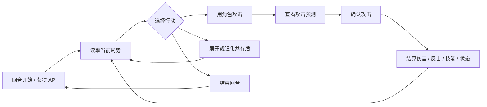

# Tiny Pixel Fights — 游戏设计文档草案

## 目录

- [游戏名称](#游戏名称)
- [GDD 日期](#gdd-日期)
- [游戏概述](#游戏概述)
- [当前阶段方向](#当前阶段方向)
- [机制](#机制)
- [用户界面](#用户界面)
- [其他参考](#其他参考)
- [更新记录](#更新记录)

---

## 游戏名称

**Tiny Pixel Fights**

暂定名 / 开发中名称。这个名字来自最初的课程作业原型，但当前项目已经从“短时间纸质卡牌作业”发展为一个数字化的战术 JRPG 卡牌战斗原型。

---

## GDD 日期

**2026年6月28日**

这是一份持续更新的 Living GDD。每当加入重大机制、调整 UI 大方向、修改平衡原则、确定长期系统方向时，都应该回到这份文档更新。

---

## 游戏概述

**Tiny Pixel Fights** 是一款二人对战的战术卡牌游戏。战场被表现为一张中世纪战争会议桌：羊皮纸地图、黑铁、旧金、战术令牌和角色卡牌。每名玩家控制一支小队，通过消耗行动点进行攻击、展开共有盾、利用角色技能、buff / debuff 和伤害类型来击败对方全部角色。

当前 demo 支持本地对战和在线对战。游戏方向已经从原本 3～5 分钟的轻量作业原型，转向更强调战术判断、资源管理和角色培养感的对战体验。当前核心感受是：**多变的战场环境、资源与选择的取舍、清楚可理解的战斗反馈，以及培养“卡中鲜活角色”的 JRPG 快感**。

长期方向以单机为主，可能扩展为爬塔 / 路线选择模式，加入英雄成长、普通士兵、副官系统、遗物、战场 round buff、剧情演出和视觉小说式对话。二人对战模式当前不承担完整单机流程，而是作为局内战斗、成长奖励、UI 可读性、角色个性和平衡性的核心试验场。

### 当前设计支柱

1. **有意义的战术选择**  
   玩家应该经常思考：“我付出了什么代价？承担了什么风险？为之后创造了什么机会？”

2. **清楚的因果反馈**  
   伤害、护盾、buff、debuff、概率和技能触发必须通过预测、图标、动画、音效、语音和日志让玩家理解。

3. **活着并会成长的角色卡牌**  
   角色不应只是静态数值棋子，而应拥有状态、声音、性格、成长潜力和被玩家在意的存在感。未来的英雄、普通兵、副官和转职都应服务于“玩家塑造了这支小队”的感受。

4. **变化的战场，而不是静态算术题**  
   未来的 round buff、天气、资源变化和队伍构成应带来局势变化，但不能变成不可读的混乱。

5. **系统优先，避免一次性补丁**  
   新机制应尽量接入通用系统：状态、modifier、光环、资源、事件、语音、动画、本地化，而不是为单一技能写死专用逻辑。

---

## 当前阶段方向

当前阶段的目标不是一次性实现完整单机爬塔，而是在对战模式中逐步验证未来单机战斗会依赖的局内成长结构。

下一阶段的核心问题是：

> 一局对战能否从“固定英雄互殴”，逐步转向“英雄带领普通兵，在战斗中通过奖励和成长形成队伍方向”？

因此，对战模式应保留当前 **Classic 4 Hero** 规则作为基线，同时逐步增加实验模式或开发开关，用于测试新的成长系统。每个实验系统必须能被单独开启、单独 playtest，并在失败时可回滚。

### 当前优先验证的体验

- 开局复杂度下降：从全部英雄技能同时登场，过渡到少量英雄 + 简单普通兵。
- 局内成长可见：玩家在一局内看到英雄或士兵发生明确变化。
- 奖励选择有取舍：三选一奖励应让玩家纠结，而不是自动选择最大数字。
- 轻量资源节奏：BP 可先作为成长货币和节奏器，而不是复杂表现评分系统。
- 对战可读性不下降：任何新成长、奖励、减伤或随机结果都必须能被 hover、预测、日志和演出解释。

### 当前暂定机制口径

- **等级条成长方案**：不进入当前对战 prototype。这个方向曾被检讨过，但会显著放大奖励、经济、UI 和数值计划复杂度，现阶段只保留为被放弃的设计备忘。
- **BP**：保留为轻量成长货币和奖励消费资源。当前对战测试口径是开局 5 BP、上限 10 BP；BP 不再推进等级，而是直接用于固定奖励窗口中的三选一奖励购买。
- **奖励选择**：固定 round 节奏触发三选一奖励。Round 1 触发第一次奖励选择，之后每隔 2 个 round 再触发一次。每次奖励选择可跳过以保存 BP，并拥有 1 次刷新机会。关键奖励如英雄升级可以有隐藏保底或权重修正，但不要求玩家阅读概率规则。
- **英雄成长**：优先验证第一次升级二选一，暂缓完整三段升级、转职和新立绘。
- **普通兵成长**：先验证普通兵是否能降低认知负担并支撑小队结构，再加入军衔、副官和兵种技能。
- **遗物与天气**：作为后续全局 modifier 系统，必须等预测、日志和奖励框架稳定后再接入。

---

## 机制

### 核心战斗循环



### 角色与小队

当前原型包含 8 名英雄角色。每名角色拥有：

- 攻击力
- HP
- 行动点消耗
- 伤害类型：物理、魔法，或绝对伤害等特殊情况
- 主动或被动技能
- 角色语音和视觉身份

角色可以死亡并从当前小队显示中移除。未来版本需要支持队伍人数变化、永久和局内数值变化、技能可用状态变化、副官系统和成长系统。

### 英雄、普通兵与实验队伍

当前 8 名角色在长期方向上更适合作为 **英雄卡**：它们承载故事、语音、技能身份和局内成长潜力。未来可以引入更简单的 **普通兵卡**，用于降低开局认知负担，并让英雄显得更特殊。

第一阶段实验队伍倾向：

- 每方 1 名英雄 + 若干普通兵，或保留 Classic 4 Hero 作为对照模式。
- 普通兵应拥有清楚的职业定位，例如标准物理兵、防御兵、魔法兵、治疗/驱散辅助。
- 普通兵第一版可以没有复杂技能，主要测试队伍结构、目标选择和英雄存在感。

如果实验成立，普通兵后续可以获得军衔、兵种技能，并在满级后成为副官。但这些系统不应与普通兵第一版同时加入。

### 行动点与 Cost

行动点是当前回合的主要资源。当前 AP 上限为 **5**。角色攻击会消耗该角色的 cost，展开共有盾也会消耗 AP。

未来设计注意：角色 cost 不应被视为固定最终值。它应该能被 buff、战场规则、遗物、事件、天气或角色成长系统修正。

### 攻击与反击

角色攻击时，攻击方和防守方会根据当前规则结算伤害与反击。确认攻击前会显示预测。攻击和反击会受到以下因素影响：

- 伤害类型
- 共有盾
- buff 与 debuff
- 角色技能
- 技能特殊例外
- 绝对伤害

战斗系统应避免盲选。如果某个机制会改变伤害结果，玩家应该能通过预测、图标、动画、音效或日志理解原因。

### 共有盾

玩家可以消耗 AP 生成队伍共享的护盾。共有盾先于 HP 吸收伤害。它是队伍资源，不是每个角色独立持有的护盾。

当前共有盾规则：

- 第一次使用会生成共有盾。
- 如果盾仍存在，再次使用会强化盾值。
- 盾会被伤害击破。
- 盾破碎时，视觉上应保持护罩直到破碎动画播放，而不是先消失再出现。

共有盾的设计目的是提供防御选择，但不能变成每回合固定最优解。

### 技能、buff 与 debuff

技能分为：

- **主动技能**：角色主动攻击时触发。
- **被动技能**：角色在场或满足指定时机时生效。

buff 与 debuff 应通过通用状态系统处理。它们可能修改伤害、攻击力、HP 回复、cost、死亡保护、护盾交互或未来系统。设计新效果时，应优先考虑通用 status / modifier 概念，而不是为单个技能增加过窄属性。

### 概率与随机性

部分效果包含概率。随机性应制造意外，而不是制造不公平感。只要概率会影响玩家规划，就应该通过文字、预测、图标或历史反馈让玩家理解风险。

### 局内奖励与轻量 BP

局内成长奖励是下一阶段的重要候选系统。第一版应优先验证奖励选择是否让战斗更好玩，而不是追求完整经济模型。

当前倾向：

- 双方开局各自获得 **5 BP**，BP 上限暂定 **10**。
- **Round 1** 触发第一次奖励选择，之后每隔 **2 个 round** 触发一次奖励选择。
- 每名玩家看到 3 个奖励选项，并拥有一次刷新机会。
- 玩家可以跳过奖励以保存 BP；跳过不等于失败，而是为之后更高价值奖励攒资源。
- 奖励按稀有度和条件随机出现，但关键成长奖励需要隐藏保底或权重保护，避免玩家完全抽不到核心成长。
- BP 是奖励消费货币，不是等级经验，不进入复杂表现评分。

当前 BP 获取规则：

```text
回合低保：+1 BP。
破坏敌方共有盾：+1 BP。
主动攻击造成生命伤害：+1 BP。
每回合最多获得 3 BP。
BP 上限：10。
```

具体数值需要拉表和 playtest。GDD 只固定设计意图：BP 应保证成长系统稳定出现，同时给主动战斗一点节奏优势，但不能成为一家独大的滚雪球引擎。

### 物理防御与魔法防御候选

未来可加入物理防御和魔法防御，用于激活现有物理 / 魔法伤害分类。该系统必须保守验证：

- 多数单位防御为 0，少数单位为 1，极少数单位可测试 2。
- 防御减伤必须进入攻击预测和 hover 说明。
- 必须观察低攻击角色是否失去行动价值。
- 必须观察对局时长是否被显著拉长。

防御参数不应只是数值膨胀，而应服务于目标选择、职业身份和未来装备 / 副官 / 天气 modifier。

### 未来系统扩展

可能加入的系统：

- 英雄升级与局内 / 永久成长
- 普通士兵 / 部下卡
- 副官槽位与副官加入
- 轻量 BP / 成长货币
- 三选一局内奖励
- 遗物 / 装备
- round-based 战场 buff
- 天气或地形效果
- 爬塔路线选择
- 视觉小说式剧情演出
- 大招 / ultra skill 演出

每个新系统都需要检查：

- 是否创造有意义的成长？
- 是否导致滚雪球？
- 是否保持战术不确定性？
- UI 是否能解释它？

---

## 用户界面

当前 UI 是 PC 优先的 1920×1080 虚拟舞台，并整体缩放到不同屏幕。战场视觉是中世纪桌面战术风格：羊皮纸地图、深色木桌、黑铁、旧金和战术 command plate。

### 主要战斗 UI

- **角色卡牌**：显示角色立绘、攻击力、HP 血球、cost 点、buff/debuff 图标，以及可行动、已行动、死亡等状态。
- **Action Point HUD**：用发光资源球显示当前 AP。
- **防御 / 结束回合按钮**：中央 command plate，用于展开共有盾和结束回合。
- **Turn / Round HUD**：显示当前 turn 和 round。
- **玩家名称**：显示敌我玩家名。
- **声音 / New 菜单**：右上角工具 HUD。
- **战况日志**：可展开查看详细战斗历史。
- **Hover 详情框**：鼠标停留卡牌时，左右显示属性、技能、buff 和 debuff 说明。
- **攻击预测框**：攻击确认前显示预测伤害、反击和技能说明。

### 反馈原则

UI 应支持课程中提到的玩家决策五阶段：

1. **Before**：玩家能读懂当前局势。
2. **Availability**：可用行动必须明显。
3. **Action**：选择、拖拽、确认要有清楚反馈。
4. **Consequences**：伤害、护盾、技能、buff、死亡要有演出。
5. **Feedback**：日志、图标、音效和语音解释发生了什么。

### 后续视觉强化方向

战场需要“活着”，但不能吵：

- 羊皮纸地图和桌面有极轻微环境动效。
- 烛光、灰尘、纸屑或魔法粒子缓慢移动。
- 地图中央法阵在重要 round 或战场 buff 时轻微呼吸。
- 可行动卡牌有更明确但符合世界观的旧金/象牙光效。
- 角色根据状态产生生命感：选中、低 HP、buff、debuff、死亡。
- 攻击和技能特效按类型区分：物理、魔法、治疗、护盾、buff、debuff、死亡。

---

## 其他参考

### Shadowverse / Shadowverse: Worlds Beyond

参考点是数字卡牌对战中的可读性、资源显示、leader 存在感、进化资源和开局仪式。不能直接照搬其手机游戏布局，因为本项目是 PC 优先，且核心是小队角色战斗，不是 leader HP 战。

可借鉴点：

- 清晰的回合与资源呈现
- 可行动卡牌的强提示
- 角色 / leader 的存在感
- 丰富的攻击和技能反馈
- 先后攻揭示与开局仪式

### Hearthstone

参考点是让卡牌桌面像实体玩具一样活起来：卡牌移动、桌面反馈、攻击冲击、战场环境感。

### Legends of Runeterra

参考点是攻击 / 防守状态的可读性，以及战斗时机反馈。

### Darkest Dungeon

长期参考点是路线选择、队伍损耗、角色身份感、阴暗战术氛围。

### JRPG / 视觉小说演出

未来参考点是角色语音、成长、剧情对话和玩家对英雄的情感投入。

---

## 更新记录

| 日期 | 修改 |
| --- | --- |
| 2026年6月28日 | 更新下一阶段方向：明确对战模式作为单机战斗与局内成长试验场；加入英雄/普通兵、局内奖励、轻量 BP、物理/魔法防御候选和分阶段 prototype 口径。 |
| 2026年6月27日 | 创建第一版 Living GDD 草案，整理当前二人对战原型、课程笔记、现有 UI 方向和未来战术 JRPG 扩展计划。 |
