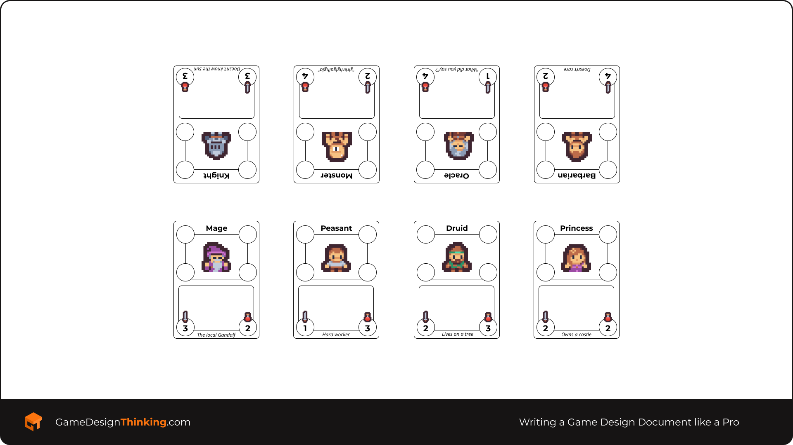
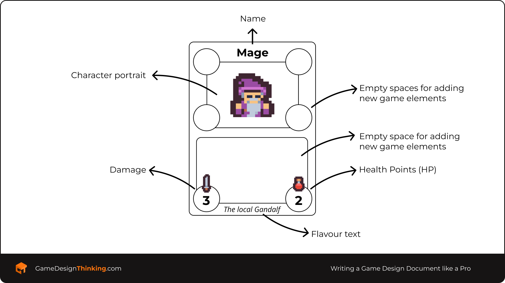
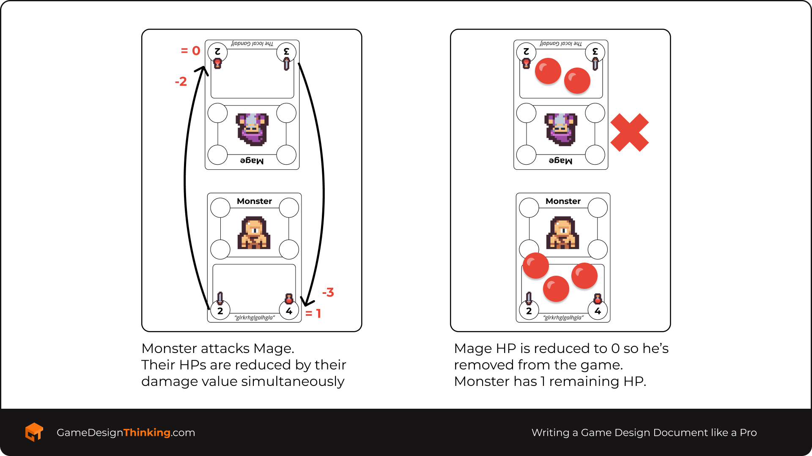

## **1.1. Tiny Pixel Fights**

The assignment game is called Tiny Pixel Fights. This is a high-fantasy pixel-art card game in which different emblematic classes and medieval fantasy town folk form groups to fight each other (because medieval times were crazy!). 

Throughout the course, you’ll modify this base game in many ways to make it your own! Every game created by our students will be different so don’t be afraid to try new things as long as they’re aligned with your design goals and it results in an engaging game.

## 1.1.1. Print & Play

Download the file below and choose one to print. You can alternatively create your cards using pen and paper. Just use the default names and numbers used in the cards for now.

Don’t print or use the files named with the *Assignment4_* prefix yet as they’ll be used later when you get to the assignment in Section 4. There’s also a file with an interactive PDF to input custom numbers and abilities that you can use later in the course.

Eventually, you can choose to create more space for adding parameters, or not use all the empty spaces. It’s your decision as the designer of the game! For now, just copy the mechanics and parameters as indicated on the cards. 

⬇️ Download this file to get the cards ⬇️

GDT Game Design Essentials Assignment Cards.zip

⬆️ Download this file to get the cards ⬆️

## 1.1.2. Tiny Pixel Fights Rules

- 2-player game
- 8 cards + 1 cheat sheet.
- **Game End:** The player who loses all their characters loses the game. The remaining player is the winner.
    - Both players can lose their last character at the same time, which results in a draw.

How to play video

How to play video

### Setup

- Choose a way to define who’s the first player.
- Each player chooses 1 character in order until both players have 4 characters each.
- Put all characters in a horizontal line facing your opponent’s characters (it doesn’t matter which characters are facing each other).

!Initial setup example

Initial setup example

### Gameplay Rules

- Each turn players take turns to attack with 1 of their characters.
- The first player chooses one of his characters (the attacker) and chooses an opponent's character to attack (the defender).
- After the player’s finished attacking with one character, it’s his opponent's turn.
- When attacking:
    - Choose the attacker and the defender.
    - When a character attacks, it reduces the life of the enemy character by the number of the attack.
    - Simultaneously, the attacker character’s life is reduced by the defender's attack value.
- Damage is accumulated, so you can use coins, glass stones or anything similar to indicate a character’s current damage.
- When a character’s life is 0 or less, the character is removed from the game.

!Card key. You can use the empty spaces to add new mechanics later in the assignment.

Attack example

## **2.3.1. List all the mechanics in Tiny Pixel Fights**

<aside>
📝 Take our assignment game (Tiny Pixel Fights) and create a bulleted list with all the mechanics of the game (at this stage). Remember that the game mechanics are the verbs players can engage in. Define each mechanic in a few paragraphs.

🔸***Gabriel’s tip —** If you are struggling to find mechanics, think of them in the following way: “The players can _____ and _____ and _____.” The _____ are likely the mechanics you are looking for!*

💭***Reflection opportunity —** how much time do you think this activity would take for a AAA game? or a small indie game? Write your reflection below.*

</aside>

`Write your bulleted list of mechanics here…`

出牌

每回合player可以打出一张牌，选择对方特定卡片进行攻击

抽牌

游戏开始时两个玩家按照顺序各自抽牌至4张

`Write your reflection here…`

## 2.3.2. Modify and/or add a new mechanic

<aside>
📝 Take one of the mechanics in the list from 2.3.1. and modify it in **any way you want** (don’t try to find the “perfectly fun” mechanic, just change it in one way). Write the modified mechanic below and then test how the game feels with the modified mechanic (that’s why you want to modify only one mechanic at a time!)

After modifying one of the existing mechanics, add a new mechanic too! If you don’t know where to start, play one of the reference games listed at the start of the document and find which mechanics seem cool to add to this game. 

After you finish modifying and/or adding a new mechanic, write a bulleted list with all the mechanics below and a few paragraphs describing each one.

🔸 ***Gabriel’s tip —** One of the best ways to see if a new or modified mechanic works in your game is to playtest them. We’ll learn more about it in the next section, but I encourage you to play the game now and check how different it feels!*

</aside>

`Write your new and modified mechanics here…`

出牌

每回合player可以打出一张牌，选择对方特定卡片进行攻击。打牌要消耗行动点。每回合回复三点，不能累积到下一回合。

抽牌

游戏开始时两个玩家按照顺序各自抽牌至4张

规则

# **Section 3: Understanding Players**

## **3.1. Using the SCAMPER technique on your favourite game**

<aside>
📝 Have some Sharpies and Post-it notes at hand. A handful of papers and pens could also be a suitable replacement.

Choose one of your favourite games. Now select two mechanics (ideally the main mechanics of the game) and pass them through **at least 4** of the SCAMPER lenses each (Substitute, Combine, Adapt, Modify, Put to another use, Eliminate, Reverse).

For this particular ideation session, **don’t judge your ideas**. Just let every idea get out, even the ones you consider bad. The more ideas you have, the better. You can repeat the process on the same lenses multiple times if you want, but it still counts as only 1 lens!

🔸***Gabriel’s tip —** Put a time limit! For each mechanic, ideate around 5-10 minutes with a timer at hand. Time pressure is the best friend of creativity!*

</aside>

`Your list of mechanics here… *(e.g., Attack + Put to another use = Attack also heals)*` 

## **3.2. Brainstorming new mechanics**

<aside>
📝 Before starting the brainstorming session, have some Sharpies and Post-it notes at hand. Remember to follow the instructions in the video, so give yourself a timer (5-10 minutes is fine), try to have a relaxed environment, and if you play music, try to use music with repetitive patterns and without lyrics.

Now, define the goal of the brainstorming session. You may be thinking of adding a specific **mechanic** that can improve the combat (movement, defence, etc.), so you can focus the brainstorming session on different ways of adding those mechanics. You may be looking for a specific **gameplay experience** (strategy, push-your-luck, etc.). Again, focus on that experience and propose mechanics that support that experience. 

When you are satisfied with the number (not necessarily the quality) of the mechanics you proposed, select the three you liked the most (or a random set of three), pass them through the SCAMPER lenses and see which variations caught your attention. This will ensure you have a handful of new ideas for the game. Yes, you are brainstorming over your brainstorming!

After this, select the **three** ideas you found more interesting and write them below, adding a brief description for each one. **Do not playtest your ideas yet!**

🔸***Gabriel’s tip —** Remember that this activity is about the **number** of ideas, not the **quality**.*

💭 ***Reflection opportunity —** How different was this brainstorming session as compared to the one for 2.3.2.? Write your reflection below.*

</aside>

`Write your three ideas here…`

`Write your reflection here…`

## **3.3. Playtest your new mechanics!**

<aside>
📝

Now you should have between 1 and 3 mechanics that you want to add to your game. The best way to judge them is to put them into practice! And the best way to do that is to hold a playtesting session.

So for this playtesting session, you need to grab another person (this is a 2-player game) and play the game with them. It would be even better if you can grab two people to play your game while you watch, analyse and take notes. 

To make the most out of this playtesting session, you should:

- **Focus on one aspect of the game** — Although it’s tempting to playtest focusing on the whole game, for this particular learning experience you should focus only on analysing one aspect of the game. It could be a combination of two mechanics (attack and life; attack and mana, etc.), players’ perception (easy to learn, hard to master; perceived fairness, etc.) or something similar.
- **Note down your desired player experience** — What experience do you want to foster in your players? Note this down in a notebook so you can use it as a lens through which you can analyse the success of your design.
- **Ask questions to players after the playtesting session** — Ask your players if they remember some aspects of your game (e.g., how attacking works, what’s the best strategy to win, etc.). The best way to know if you have a sticky design is to check if your players remember your game!

🔸***Gabriel’s tip —** use the ruleset provided in the assignment and add any modification in mechanics you have included thus far, and give that to your players so they can play the game. Ask them any questions they have **before** they start playing the game. If they have questions while playing the game, ask them: “How do you think that works?”. After you listen to their answer, consider communicating to them the correct way of playing the game if that interferes with your playtesting goals, but also be open to allowing them to play in an “incorrect” way and question why would players prefer to play in a way contrary to your desired player’s experience and design goals.*

💭***Reflection opportunity —** Note down below how you think the playtesting session went. Were you able to test your goals? Do you think you need to change some game mechanics? What was the hardest part of running a playtesting session? Write your reflection below.*

</aside>