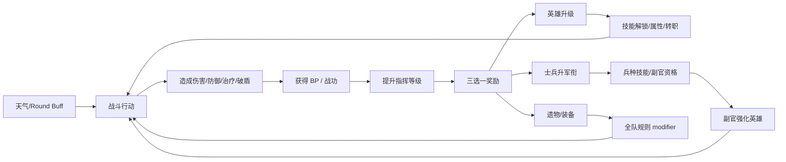

# Tiny Pixel Fights — GDD Brainwriting: 对战试验场与局内成长方向

> 日期：2026-06-27  
> 状态：Brainwriting / Ideate 阶段  
> 目的：整理“对战模式作为未来单机战斗试验场”的机制狂想，分类评估新机制是否值得进入后续 GDD、prototype 和 playtest。  
> 重要声明：本文不是正式规则，不修改当前 GDD，也不代表任何机制已经定稿。

---

## 0. 这次讨论的起点

当前项目的长期愿景已经从“一个短局双人卡牌作业原型”扩展为：

> 以单机为主，结合《Slay the Spire》式路线选择、遗物奖励和重复游玩价值，以及 JRPG 式角色局内成长、转职、故事和养成快感。

但当前阶段的 GDD 仍应服务于 **对战模式**。

对战模式的职责不是成为最终产品的完整形态，而是：

- 验证局内战斗的核心手感。
- 验证新资源、新数值、新角色机制是否能被玩家理解。
- 验证 UI、预测、日志、动画、音效能否解释复杂结果。
- 验证未来单机系统中的局内成长、士兵、副官、遗物、天气等元素进入战斗后是否会破坏节奏。
- 作为未来单机模式的 combat vertical slice，而不是完整 campaign prototype。

因此，对战模式的 GDD 需要比现在更明确地说明：

```text
对战模式 = 战斗规则试验场 + 局内成长试验场 + 平衡与可读性试验场
单机模式 = 长期目标，不是当前实现目标
```

---

## 1. 参考框架

### 1.1 课程方法

这次 Brainwriting 主要沿用课程笔记中的几个工具：

- **Find the Game / Define the Pillars**：先确认游戏想提供的体验，再决定机制是否值得加入。
- **Brainwriting**：先大量记录想法，不在第一时间杀掉。
- **SCAMPER**：对已有机制做替换、组合、适配、修改、删除、反转。
- **玩家五阶段决策**：Before、Availability、Action、Consequences、Feedback。
- **Interesting Decisions**：Trade-off、Risk-Reward、Yomi、Planning。
- **Systems Thinking**：每个系统都必须有目的、连接和反馈循环。
- **Probability Communication**：随机性必须可理解、可应对，而不是让玩家觉得被系统摆布。

### 1.2 外部游戏参考

这里只借鉴机制与体验，不复制规则。

| 游戏 | 可借鉴点 | 对本项目的意义 |
|---|---|---|
| Slay the Spire | 遗物、路线选择、奖励三选一、构筑逐步成形 | 未来单机主循环的参考，但当前对战只借“局内奖励选择”和“成长带来玩法分歧” |
| Shadowverse | 进化点、资源清晰、卡牌华丽反馈、局内关键节点 | 可借鉴“有限次数强力成长/进化”的仪式感，以及可用/不可用的强 UI 提示 |
| Hearthstone | 桌面可读性、关键词、发现三选一、随机但强反馈 | 可借鉴“奖励选择短促明确”和“卡牌效果用关键词收束复杂度” |
| JRPG | 转职、职业身份、角色成长、技能树、故事解锁 | 支撑“英雄卡不是工具卡，而是活着的角色” |
| 当前 Tiny Pixel Fights | AP/Cost、攻击反击、共享盾、状态、角色技能 | 是所有新机制必须尊重的战斗骨架 |

---

## 2. 更新后的设计支柱候选

当前 GDD 的五个支柱仍然成立，但如果要承接“单机长期目标 + 对战试验场”，可以考虑把支柱稍微改写得更有方向性。

### Pillar A：短局中也能成长

玩家不只是在一开始拿到四张静态卡，而是在一场对战内让队伍逐步成形。成长要快、明显、可选择，不能变成漫长养成表格。

设计含义：

- 局内成长必须在 5～10 分钟尺度内产生体验差异。
- 成长奖励应该改变行动路线，而不只是单纯数字膨胀。
- 玩家需要看到“我的选择造就了这支队伍”。

### Pillar B：战斗选择有代价，有准备，有反制

攻击、开盾、升级、养兵、拿遗物、等 BP 都应产生机会成本。强机制可以存在，但要有成本、窗口或反制。

设计含义：

- 不能让某个奖励或成长路线变成无脑最优。
- BP、英雄升级、遗物不能只奖励领先者继续领先。
- 对手应该能通过观察状态和预测面板理解对方下一步威胁。

### Pillar C：复杂度逐步进入，而不是开局倾泻

现在一开局 8 个英雄技能全公开，认知负担高。未来应允许从普通兵和白板英雄开始，让技能、转职、遗物逐步进入。

设计含义：

- 普通兵应比英雄简单。
- 英雄初始可以是白卡，但锁定技能必须可预览。
- 第一次升级解锁技能，第二次升级强化数值，第三次升级转职，是一个天然教学曲线。

### Pillar D：公开、可解释、可回放的因果链

每个成长、随机奖励、天气、遗物、伤害修正都要能被预测、hover、日志和演出解释。

设计含义：

- 任何新 modifier 都必须能进入预测面板。
- 奖励选择不能只写“变强了”，要说明来源和影响。
- 物防、魔防、天气、遗物这类全局规则必须显示在卡面、战场或 hover 中。

### Pillar E：对战模式是单机系统的显微镜

对战模式不需要一次承载完整单机爬塔，但要能小规模验证单机系统的战斗部分。

设计含义：

- 对战模式可以有实验规则开关。
- 每次只验证一个系统层：防御参数、普通兵、BP、英雄升级、遗物、天气。
- 对战可接受“不是最终平衡”，但不能接受“玩家看不懂发生了什么”。

---

## 3. 机制总分类

用户提出的 10 个想法可以分为 6 个系统群：

| 系统群 | 包含想法 | 核心问题 |
---|---|---|
| 战斗数值层 | 物理防御、魔法防御 | 是否让物理/魔法分类更有意义，而不导致伤害过低 |
| 开局队伍层 | 英雄卡、普通兵卡、开局 1～2 英雄 | 如何降低开局认知负担，同时保留英雄特殊感 |
| 局内成长层 | 指挥等级、BP、英雄升级、士兵军衔 | 如何让一局内形成 JRPG 成长曲线 |
| 奖励经济层 | 三选一奖励、遗物、装备、BP 消耗 | 如何让奖励选择有取舍，而不是领先者滚雪球 |
| 角色扩展层 | 转职、副官、兵种技能、新立绘 | 如何让同一英雄产生不同 Build |
| 战场规则层 | 天气、round buff、全局 AP/BP/伤害变化 | 如何制造变化战场，而不是不可读混乱 |

---

## 4. 机制 1：物理防御与魔法防御

### 4.1 原始想法

新增两个参数：

- 物理防御：减少受到的物理伤害。
- 魔法防御：减少受到的魔法伤害。

数值保守，例如最高 2。骑士物防较高，魔法使物防 0，占卜师魔防高。

目的：进一步激活现有的物理/魔法分类，让伤害类型不只是图标和少数技能条件。

### 4.2 支持的设计目标

这个机制明显支持：

- 变化战场，而不是纯算术题。
- 有意义的目标选择。
- 角色职业身份。
- 未来装备、遗物、天气的 modifier 空间。

它能让玩家思考：

```text
我该用物理高攻打低物防目标，
还是用魔法攻击绕开骑士的物防？
```

### 4.3 主要风险

| 风险 | 说明 |
---|---|
| 固定减伤过强 | 当前攻击值只有 1～4，减 2 会让低攻角色经常打 0 |
| 对局拖慢 | HP 已经提高，防御参数再加入可能显著拉长 TTK |
| 预测复杂度上升 | 玩家需要理解攻击、反击、盾、预见、守护、防御参数的顺序 |
| 低攻击角色受害 | 公主、占卜师、德鲁伊等 1 攻角色可能更难造成可感知伤害 |
| 与共享盾重叠 | 物防/魔防和盾都在“减少入伤”，需要明确差异 |

### 4.4 可能的结算顺序

如果加入，推荐先概念上这样排序：

```text
1. 攻击方增减伤
2. 受击方防御参数减伤
3. 预见等概率减伤
4. 共享盾吸收
5. 骑士守护
6. 扣 HP
```

但这不是唯一方案。

另一种可读性更强的顺序是：

```text
基础伤害
- 防御参数
- 状态/预见修正
- 盾吸收
= 最终 HP 伤害
```

玩家在预测面板里可以看到：

```text
物理攻击 4
- 目标物防 1
- 预见可能 -1
- 共享盾吸收 2
= 预计 0～1 HP 伤害
```

### 4.5 设计变体

| 变体 | 说明 | 倾向 |
---|---|---|
| A：固定物防/魔防 | 卡面常驻参数，直接减伤 | 最直观，但最容易拖局 |
| B：防御只减主动攻击 | 不减反击、技能、状态 | 更好控节奏，但规则多一条 |
| C：防御有下限 | 防御后至少造成 1，除非盾吸收 | 保护低攻角色价值 |
| D：防御改为概率减伤 | 物防 2 = 50% 减 1 或减 2 | 复杂且和预见重叠，不推荐早期 |
| E：防御只作为装备/遗物来源 | 基础卡不新增参数，未来装备提供 | 降低当前 UI 压力 |
| F：防御改为关键词 | 重甲：物理 -1；抗魔：魔法 -1 | 比数字参数更易读 |

### 4.6 我的倾向

值得 prototype，但不应第一个大系统就和 BP、成长、天气一起上。

推荐最小版本：

- 只给部分角色加 `物防 0～1`、`魔防 0～1`。
- 暂不出现 2，除非骑士或占卜师专属。
- 预测面板明确列出减伤来源。
- 防御后普通攻击最低仍可为 0，但要观察低攻角色是否被废掉。
- 表格先拉 TTK：物防/魔防加入后，各角色互打需要几次行动。

### 4.7 是否进入 GDD

可以进入 GDD 的“候选战斗扩展”章节，但不要立即写成正式规则。

建议表述：

> 后续可能引入物理防御与魔法防御，作为激活伤害类型和装备/天气系统的基础参数。该系统必须经过表格模拟和短局 prototype，确保不会让低攻击角色失去行动价值或显著拖长对局。

---

## 5. 机制 2：英雄卡从白卡开始，局内成长

### 5.1 原始想法

现有 8 张卡作为英雄卡。每个英雄有故事和从故事衍生的技能。

游戏不再一开始每人发 4 张完整英雄，避免认知负担过重和英雄缺乏特殊感。开局玩家各自选择 1 或 2 张英雄，剩余位置由普通兵填充。

英雄初始是白卡，但玩家能看到锁定的两个初级技能。通过局内升级逐步解锁。

### 5.2 支持的设计目标

这是最能支撑“JRPG 养成快感”的想法。

它能解决当前问题：

- 开局信息太多。
- 英雄技能同时涌入，玩家记不住。
- 英雄缺少“成长为我自己的角色”的过程。
- 对战模式可以模拟未来单机中从普通队伍成长为英雄队伍的过程。

### 5.3 开局 1 英雄还是 2 英雄

| 方案 | 队伍结构 | 优点 | 风险 |
---|---|---|---|
| 1 英雄 + 3 士兵 | 英雄非常特殊，认知负担最低 | 最适合教学和单机第一层 | 对战初期可能太像普通兵互殴 |
| 2 英雄 + 2 士兵 | 开局就有英雄组合和协同 | 对战更有看点 | 认知负担仍较高，升级目标分散 |
| 1 初始英雄 + 第 1 次升级很快拿第 2 英雄 | 起手简单，成长快 | 兼顾节奏 | 需要 BP/奖励系统支撑 |
| 双方同时从 2～3 张候选中选 1 | 有自主感 | 选角阶段增加时间 | 要保证候选平衡 |

我的倾向：

- 单机最终：1 英雄 + 3 士兵起步。
- 对战 prototype：可以试 2 种模式。
  - Mode A：1 英雄 + 3 士兵，验证学习曲线。
  - Mode B：2 英雄 + 2 士兵，验证对战趣味和升级分歧。

### 5.4 英雄白卡的好处

白卡不是“没意思”，而是“有期待”：

- 玩家看到两个锁定技能，会产生成长目标。
- 第一次升级时，英雄获得身份。
- 同一个英雄可以因为第一次技能选择不同而走不同路线。
- 第三次转职再把身份彻底推开。

这与影之诗的进化点有一点类似：玩家知道某张卡未来会变强，关键是何时、把资源投给谁。

### 5.5 关键 UI 需求

英雄卡必须能显示：

- 当前阶级：白卡 / 技能解锁 / 强化 / 高级 Class。
- 已选择的初级技能。
- 未选择或锁定的技能。
- 下次升级会发生什么。
- 当前升级次数：0/3、1/3、2/3、3/3。

不能让玩家在奖励三选一时才第一次看到“升级后会发生什么”。这会变成盲选。

---

## 6. 机制 3：指挥等级

### 6.1 原始想法

每个玩家在一场对战内拥有独立指挥等级。

- 默认 1 级。
- 重开游戏清零。
- 升级需要累计 BP。
- 指挥等级不会倒退。
- 升级后可以在己方回合进行三选一奖励。

### 6.2 设计意义

指挥等级是把“单机 run 内成长”压缩进一场对战的骨架。

它可以连接：

- BP 获取。
- 英雄升级。
- 普通兵军衔。
- 遗物/装备。
- 天气/战场事件。
- 玩家长期规划。

如果没有指挥等级，所有成长奖励都会变成零散事件。如果有指挥等级，就有了一个清楚的进度条：

```text
战斗行动 → 获得 BP → 指挥等级提高 → 奖励选择 → 队伍变化 → 新战斗行动
```

### 6.3 核心风险：滚雪球

指挥等级天然是强化循环：

```text
造成伤害/击破敌人
→ 获得 BP
→ 升级拿奖励
→ 更容易造成伤害/击破敌人
→ 获得更多 BP
```

这很爽，但对战模式中危险。

如果领先者越打越强，后手或弱势方会更快失去自主感。

### 6.4 反滚雪球设计方向

| 方向 | 说明 |
---|---|
| 失败补偿 BP | 被击破、盾被打破、低 HP 存活也能给 BP |
| BP 来源多元 | 不只击杀，治疗、破盾、承伤、触发技能也能给 |
| 等级阈值递增 | 越往后越难升，避免爆炸成长 |
| 奖励要花累计 BP | 强奖励会延迟其他选择，但等级不倒退 |
| 弱势奖励权重 | 落后方更容易出现防守/恢复/士兵补强 |
| 同步奖励时机 | 双方每个 round 末都结算一次，减少一方连续成长 |
| 每回合 BP 上限 | 防止单回合连锁爆发直接升多级 |

### 6.5 指挥等级是否应该双方共享节奏

三种方向：

| 方案 | 说明 | 判断 |
---|---|---|
| 独立等级 | 各自 BP 各自升级 | 自主感强，但滚雪球风险高 |
| Round 共享等级 | 每隔几回合双方都获得奖励 | 公平但不奖励表现 |
| 独立等级 + 落后补偿 | 各自成长，但弱势方也有 BP 路径 | 推荐 |

对战模式推荐第三种。

单机模式中可以更大胆使用强化循环，因为敌人不需要公平；对战模式中必须有平衡循环。

---

## 7. 机制 4：BP（Brave Point）

### 7.1 原始想法

BP 是局内新资源。通过特定操作获得，例如：

- 造成伤害。
- 破盾。
- 击破敌人。
- 其他勇敢行为。

累计 BP 到阈值提升指挥等级。奖励需要消耗累计 BP，但不会导致指挥等级倒退。

### 7.2 BP 的设计定位

BP 不应该只是“经验值”。它更适合表达：

> 玩家在战斗中做出有价值、有风险、有戏剧性的指挥行为，从而积累士气和指挥威望。

这样它可以连接主题和机制。

### 7.3 BP 来源候选

#### A. 进攻型来源

| 来源 | 优点 | 风险 |
---|---|---|
| 造成 HP 伤害 | 直观，鼓励推进 | 领先者更容易继续领先 |
| 击破敌人 | 有高潮 | 强滚雪球，最危险 |
| 破盾 | 激活盾牌对抗 | 若盾少用则来源不稳定 |
| 造成过量伤害 | 鼓励爆发 | 可能奖励已经赢的玩家 |
| 用低 Cost 角色造成高伤害 | 奖励效率 | 规则略复杂 |

#### B. 防守型来源

| 来源 | 优点 | 风险 |
---|---|---|
| 自己的盾被打破 | 弱势方补偿 | 可能鼓励无脑开盾挨打 |
| 角色低 HP 存活 | 戏剧性强 | 需要清楚触发时机 |
| 骑士守护触发 | 奖励保护行为 | 只有有骑士时可用 |
| 成功治疗有效 HP | 让公主/牧师有成长贡献 | 可能拖局 |
| 预见成功减伤 | 奖励防御构筑 | 概率触发需要记录 |

#### C. 技巧型来源

| 来源 | 优点 | 风险 |
---|---|---|
| 打出本回合第 3 次行动 | 鼓励 AP 规划 | 低 Cost 队伍天然吃香 |
| 用 0 伤害触发怪物绝对追击 | 奖励理解规则 | 太专属 |
| 用德鲁伊驱散 Buff | 奖励控制 | 专属但可作为技能 BP |
| 用狂战余波击中相邻目标 | 奖励站位理解 | 专属但有趣 |
| 完成回合目标 | 可控、可教学 | 需要额外 UI |

### 7.4 推荐的 BP 来源第一版

为了对战公平和可读，第一版不建议只用击杀。

可以试：

```text
每回合最多获得 5 BP：

+1 BP：每造成 2 点 HP 伤害，向下取整或达到阈值时给
+1 BP：本回合首次破坏敌方共享盾
+1 BP：己方角色以 3 HP 或以下存活过一次敌方攻击
+2 BP：击破敌方角色
+1 BP：有效治疗或防止至少 2 点伤害
```

但这已经偏复杂。更小的 prototype 可以先用：

```text
+1 BP：造成任意 HP 伤害，每次行动最多一次
+1 BP：击破敌方角色
+1 BP：己方角色在受到伤害后仍存活且 HP <= 3，每回合最多一次
```

### 7.5 BP 的名字

Brave Point 可以保留，但也可以考虑更贴合中世纪战术桌的名字：

- Command Point / CP：指挥点。直观，但和 AP 容易混。
- Valor / 勇气值：主题强。
- Morale / 士气：适合全队成长。
- Renown / 战功：适合升级和奖励。
- Tactics / 战术点：偏理性。

如果已有 AP，最好避免另一个 `Point` 太像。中文可以叫“战功”，英文叫 `Valor` 或 `Renown`。

我的倾向：

```text
内部暂用 BP。
GDD 概念可称为“战功 / Valor”。
```

---

## 8. 机制 5：指挥等级奖励三选一

### 8.1 原始想法

指挥等级提升后，玩家可以在己方回合进行肉鸽式三选一奖励。奖励需要消耗 BP。

奖励包括：

- 英雄升级。
- 普通兵军衔提升。
- 遗物。
- 装备。
- 强力持续效果。

越强奖励消耗越多，出现概率越低。

### 8.2 三选一的作用

三选一很适合本项目，因为：

- 它短促。
- 它支持自主感。
- 它能让同一局形成不同 Build。
- 它可以把复杂内容分批释放。
- 它可作为未来单机奖励节点的缩影。

### 8.3 对战模式中的时机问题

奖励什么时候选，会显著影响节奏。

| 时机 | 优点 | 风险 |
---|---|---|
| 升级当场立刻弹出 | 成长反馈即时 | 打断战斗节奏，对手等待 |
| 己方回合开始可点奖励按钮 | 玩家有控制 | 可能忘记，UI 增加按钮 |
| Round 结束统一选 | 公平清楚 | 成长反馈延迟 |
| 结束回合后弹出 | 不打断行动 | 对手等待 |
| 作为一个 AP 行动 | 有机会成本 | 复杂，但很有趣 |

推荐第一版：

```text
当指挥等级提升时，记录“可领取奖励”。
在该玩家下一个己方回合开始时，进入短促奖励选择。
选择奖励不消耗 AP，但每回合最多领取一次。
```

这样避免一次攻击后突然弹窗打断战斗演出。

### 8.4 奖励稀有度

| 稀有度 | 例子 | BP 消耗 | 出现原则 |
---|---|---:|---|
| Common | 普通兵 +HP、英雄 +1 HP、获得 1 层盾 | 低 | 经常出现，用来稳定成长 |
| Uncommon | 普通兵升军衔、英雄第一次技能解锁 | 中 | 核心成长来源 |
| Rare | 遗物、装备、英雄第二次属性强化 | 高 | 改变 Build |
| Epic | 英雄转职、高级技能、强力遗物 | 很高 | 一局少数几次，必须有仪式 |

### 8.5 随机奖励的公平问题

必须避免：

```text
一方一直抽到英雄升级，
另一方一直抽到小兵 +HP。
```

解决方向：

- 奖励池带“保底”：若某玩家连续两次没看到英雄升级，第三次必出。
- 三选一中至少一项永远是稳定通用奖励。
- 玩家可选择跳过，获得 BP 折扣券或刷新货币。
- 奖励根据队伍状态加权：已有可升级英雄时更容易出现英雄升级。
- 对战模式可使用相同稀有度分布，但具体奖励不同。

---

## 9. 机制 6：英雄三段升级与高级 Class

### 9.1 原始想法

英雄最多升级 3 次：

1. 第一次：解锁基础技能。二选一。一个通常是当前英雄技能，另一个是新增初级技能。
2. 第二次：提升基础属性。
3. 第三次：转职为高级 Class。二选一。不同高级 Class 有不同属性、新立绘、高级技能。

高级 Class 继承第一次选择的初级技能。

### 9.2 为什么这个结构很强

这是一个很干净的 JRPG 成长骨架：

```text
白卡英雄
→ 学会第一个身份技能
→ 训练面板
→ 选择职业道路
```

它既能教学，也能制造情感：

- 第一次升级：玩家开始理解这个英雄。
- 第二次升级：玩家感到英雄变强。
- 第三次升级：玩家定义这个英雄是谁。

### 9.3 英雄升级的核心张力

玩家会问：

```text
我应该集中培养一个英雄，
还是让多个英雄均衡成长？
```

这是非常好的规划选择。

但对战中需要防止“一神带队”过强：

- 单个英雄升级次数上限 3。
- 转职强，但不应直接决定胜负。
- 敌方应能看到该英雄下一阶段威胁。
- 成长奖励应该有 BP 成本，导致其他角色或遗物延迟。

### 9.4 初级技能二选一的设计原则

每个英雄两个初级技能应满足：

- 都能一句话解释。
- 都符合角色故事。
- 一个偏原始定位，一个偏变体玩法。
- 选择后影响后续转职倾向，但不锁死。

例子：公主。

| 技能 | 方向 | 说明 |
|---|---|---|
| 圣女的祈祷 | 续航 | 己方回合开始治疗全队 |
| 王旗鼓舞 | 指挥 | 本回合第一名行动的友方攻击 +1 或获得 BP |

例子：骑士。

| 技能 | 方向 | 说明 |
|---|---|---|
| 身代わりの盾 | 守护 | 当前守护技能 |
| 决斗宣言 | 挑衅 | 攻击目标后，目标下回合攻击骑士以外角色时伤害 -1 |

例子：魔法使。

| 技能 | 方向 | 说明 |
|---|---|---|
| 灼热刻印 | 延迟伤害 | 当前炎上技能 |
| 魔力爆裂 | 爆发 | 若目标没有盾，本次魔法伤害 +1，但自身承受 1 反噬 |

### 9.5 高级 Class 设计原则

高级 Class 不应只是数值 +2，而应改变核心玩法。

每个高级 Class 应回答：

- 这个职业 fantasy 是什么？
- 它鼓励什么队伍？
- 它改变哪个玩家动词？
- 它有什么反制方式？

公主示例：

| Class | Fantasy | 高级技能方向 |
---|---|---|
| 战场指挥官 | 公主从被保护者变成指挥核心 | 每回合首次普通兵行动返还 1 BP，或普通兵攻击 +1 |
| 大神官 | 强治疗与净化 | 治疗时移除一个 debuff，或濒死友方获得一次免死 |

骑士示例：

| Class | Fantasy | 高级技能方向 |
---|---|---|
| 圣盾骑士 | 保护全队 | 守护可对魔法触发，但每回合仍一次 |
| 黑铁决斗者 | 单挑压制 | 攻击高攻击目标时获得额外物防或降低目标反击 |

怪物示例：

| Class | Fantasy | 高级技能方向 |
---|---|---|
| 王庭野兽 | 与公主故事绑定 | 公主存活时追击增强，公主死亡时暴走 |
| 深渊吞噬者 | 自我强化怪物 | 击破敌人获得永久攻击，但 Cost +1 或受到更多魔法伤害 |

### 9.6 高级 Class 的资源/开发成本

这是很有魅力但很重的系统。

成本包括：

- 每个英雄 2 个初级技能。
- 每个英雄 2 个高级 Class。
- 每个高级 Class 新立绘。
- 每个高级技能的图标、文本、预测、音效、动画、测试。
- UI 支持锁定技能、已选技能、转职预览。

因此它是长期核心方向，但不适合一次性实装。

对战 prototype 可先做：

```text
只选 2 名英雄做完整 3 段升级样板：
公主 + 骑士 或 公主 + 魔法使。
```

---

## 10. 机制 7：普通兵卡

### 10.1 原始想法

加入普通兵卡，分为：

- 物理高攻脆皮。
- 物理高防弱攻。
- 魔法高攻脆皮但高魔防。
- 辅助类，回血或驱散 buff。

每类 1～2 个单位。普通兵技能简单甚至没有技能，认知负担低。开局随机选择 2 或 3 个普通兵，与 1 或 2 个初期英雄组成队伍。

### 10.2 普通兵的设计价值

普通兵非常适合解决“英雄开局太多”的问题。

他们的作用不是抢英雄戏份，而是：

- 作为新玩家学习 AP/Cost/攻击/反击的低复杂度单位。
- 填补队伍位置。
- 提供基础物理/魔法/防御/治疗功能。
- 成为未来副官系统的材料。
- 让英雄显得更特别。

### 10.3 普通兵与英雄的差异

| 维度 | 英雄 | 普通兵 |
---|---|---|
| 技能复杂度 | 高，可成长 | 低，最多一个兵种技能 |
| 故事 | 有个人故事 | 有兵种身份 |
| 成长 | 技能、属性、转职 | 军衔、兵种技能、副官 |
| 视觉 | 独特立绘 | 可复用兵种立绘 |
| 战斗价值 | Build 核心 | 支撑、过渡、材料 |

### 10.4 兵种草案

| 兵种 | Cost | ATK | HP | 物防 | 魔防 | 类型 | 特征 |
---|---:|---:|---:|---:|---:|---|---|
| 剑兵 | 1 | 2 | 12 | 0 | 0 | 物理 | 标准士兵，无技能 |
| 枪兵 | 1 | 3 | 8 | 0 | 0 | 物理 | 高攻脆皮 |
| 盾兵 | 1 | 1 | 16 | 1 | 0 | 物理 | 高防低攻 |
| 术士 | 1 | 2 | 10 | 0 | 1 | 魔法 | 标准魔法兵 |
| 咒术兵 | 1 | 3 | 7 | 0 | 2 | 魔法 | 高魔攻高魔防但极脆 |
| 牧师 | 1 | 1 | 10 | 0 | 1 | 魔法/辅助 | 回合开始治疗相邻受伤友方 1 |
| 斥候 | 1 | 1 | 9 | 0 | 0 | 物理 | 行动后获得 1 BP，低战斗力 |
| 破盾兵 | 1 | 2 | 9 | 0 | 0 | 物理 | 对盾造成额外 1 点吸收压力 |

数值只是脑暴，必须重新拉表。

### 10.5 普通兵数量

第一版不宜超过 4 个兵种。

推荐：

- 剑兵：标准物理。
- 盾兵：防御。
- 术士：标准魔法。
- 牧师：辅助治疗。

等基础跑通后，再加枪兵、咒术兵、破盾兵等变体。

### 10.6 开局普通兵选择

| 方案 | 说明 | 倾向 |
---|---|---|
| 固定开局士兵 | 每人固定剑兵、盾兵、术士 | 最适合测试 |
| 随机三选二 | 给玩家一点自主 | 稍增流程 |
| 完全随机 | 重玩变化大 | 对战公平风险 |
| 轮流 draft | 策略性强 | 开局变慢 |

对战 prototype 推荐固定或半固定：

```text
每人 1 英雄 + 3 普通兵：
剑兵 + 盾兵 + 术士。
若需要治疗测试，则把术士或剑兵换成牧师。
```

---

## 11. 机制 8：普通兵军衔与兵种技能

### 11.1 原始想法

指挥等级奖励中可能出现已经持有的普通兵。选择后提升该普通兵军衔。

军衔提升前几次加基础属性。最高级解锁兵种技能。最高级普通兵可以成为副官。

### 11.2 设计价值

普通兵军衔给玩家一个很好的取舍：

```text
我是升级英雄，
还是把这个不起眼的士兵培养成可担任副官的老兵？
```

这很有 JRPG 队伍感。

### 11.3 推荐军衔结构

不要太多级。对战一局内最多 2～3 次成长。

```text
Rank 0：新兵，基础属性
Rank 1：属性 +1 或 +2 HP
Rank 2：属性 +1 或 +2 HP
Rank 3：解锁兵种技能，并可担任副官
```

或者更短：

```text
Rank 0：基础
Rank 1：属性强化
Rank 2：解锁兵种技能 + 可副官
```

对战模式推荐短版。

### 11.4 兵种技能示例

| 兵种 | 兵种技能 |
---|---|
| 剑兵 | 本回合若已方英雄已经行动，剑兵攻击 +1 |
| 枪兵 | 攻击满 HP 目标时攻击 +1 |
| 盾兵 | 每回合第一次受到物理伤害时减 1 |
| 术士 | 攻击带盾目标时，先额外消耗 1 点盾 |
| 咒术兵 | 对带 debuff 的目标魔法伤害 +1 |
| 牧师 | 己方回合开始，治疗最低 HP 友方 1 |
| 斥候 | 行动后获得 1 BP，每回合一次 |
| 破盾兵 | 对共享盾造成的吸收量 +1 |

这些技能都应尽量像关键词一样短。

### 11.5 风险

普通兵若成长太强，会抢走英雄主角感。

解决：

- 普通兵最高 Rank 后仍不转职。
- 普通兵技能比英雄技能更单一。
- 副官化会让士兵离开战场，成为英雄强化来源。
- 普通兵成长更多是“服务英雄”，不是取代英雄。

---

## 12. 机制 9：副官

### 12.1 原始想法

满军衔、解锁兵种技能的普通兵可以拖动到英雄卡上，成为副官。

副官提升英雄基础属性，并提供某种增益。

### 12.2 副官的核心问题

副官系统必须回答：

```text
我为什么要把一个可行动单位，从战场上移除，
挂到英雄身上？
```

如果副官只是 +1 ATK，可能太无聊。
如果副官提供复杂技能，又会让英雄卡过载。

### 12.3 副官设计模式

#### 模式 A：属性继承

副官提供固定属性：

- 剑兵副官：英雄 ATK +1。
- 盾兵副官：英雄 HP +3 或物防 +1。
- 术士副官：英雄魔法伤害 +1。
- 牧师副官：英雄回合开始治疗自身 1。

优点：简单。
风险：像装备，不够特别。

#### 模式 B：兵种技能转化

副官不直接行动，但把自己的兵种技能弱化后给英雄。

例：

- 盾兵副官：英雄每回合第一次受到物理伤害 -1。
- 牧师副官：英雄行动后治疗相邻友方 1。
- 斥候副官：英雄首次行动后 +1 BP。

优点：有身份。
风险：复杂度提高。

#### 模式 C：英雄技能增强器

副官只增强英雄已有技能。

例：

- 牧师副官 + 公主：公主治疗量 +1。
- 盾兵副官 + 骑士：守护代伤降低。
- 术士副官 + 魔法使：炎上伤害 +1。

优点：Build 感最强。
风险：需要大量专属组合文本。

#### 模式 D：副官作为一次性爆发

副官平时提供小属性。玩家可消耗副官，触发一次强效果。

例：

- 盾兵副官牺牲：本回合全队获得盾 4。
- 牧师副官牺牲：复活一个刚阵亡角色，1 HP。

优点：戏剧性强。
风险：复杂，适合单机，不适合当前对战第一版。

### 12.4 对战 prototype 推荐

第一版副官只用模式 A 或 B。

限制：

- 每个英雄最多 1 名副官。
- 副官附着后不能在本场战斗中更换。
- 副官不再作为战场单位。
- 副官加成必须显示在英雄 hover 中。
- 副官提供的 modifier 要进入预测。

示例：

| 副官 | 加成 |
---|---|
| 剑兵 | 英雄主动攻击 +1 |
| 盾兵 | 英雄物防 +1 |
| 术士 | 英雄魔法伤害 +1，若英雄本身不是魔法攻击则不生效 |
| 牧师 | 英雄己方回合开始回复 1 HP |

这已经足够验证“士兵转化为英雄养成材料”是否好玩。

---

## 13. 机制 10：遗物 / 装备

### 13.1 原始想法

指挥等级奖励中可能出现类似 STS relic 的遗物或装备。它们提供持续效果，例如物理单位全员攻击 +1。

强力遗物需要更多 BP。

### 13.2 遗物的定位

遗物是全队 Build 方向的加速器。

它和英雄升级的区别：

- 英雄升级强化单个角色。
- 士兵军衔强化普通单位或副官材料。
- 遗物强化队伍规则或某类行为。

### 13.3 遗物设计原则

- 一句话能理解。
- 效果进入预测和 hover。
- 不要过多改变基础规则。
- 强遗物必须有代价、条件或高 BP 成本。
- 对战模式中避免“永久全队大幅增伤”这种很难反制的效果。

### 13.4 遗物示例

#### Common

| 遗物 | 效果 |
---|---|
| 老兵磨刀石 | 己方第一个行动的物理角色主动攻击 +1 |
| 星银护符 | 己方第一个受到魔法伤害的角色减 1 |
| 战术旗帜 | 每回合第一次普通兵行动后 +1 BP |
| 备用绷带 | 每回合开始，最低 HP 角色回复 1，但不能超过上限 |

#### Uncommon

| 遗物 | 效果 |
---|---|
| 破盾锤 | 对共享盾造成的吸收量 +1 |
| 司令官印章 | 领取奖励后，本回合第一名英雄 Cost -1，最低 1 |
| 黑铁阵图 | 防御指令首次使用时盾 +1，但本回合获得 BP -1 |
| 魔导焦镜 | 魔法角色攻击无盾目标时 +1 |

#### Rare

| 遗物 | 效果 |
---|---|
| 双生王冠 | 每次英雄升级时，随机普通兵也获得 1 次军衔 |
| 血誓战旗 | 己方角色 HP <= 5 时主动攻击 +1 |
| 古代兵法书 | 每回合第三次角色行动获得 +2 BP |
| 星读残卷 | 预见成功时，获得 1 BP |

#### Epic

| 遗物 | 效果 |
---|---|
| 破碎王座 | 英雄转职时，立刻获得一次额外奖励选择；之后 BP 获取 -1 |
| 龙骨号角 | 全体物理攻击 +1，但敌方击破己方角色时获得额外 BP |
| 禁忌魔炉 | 魔法攻击 +2，但每次魔法攻击后自身受到 1 绝对伤害 |
| 战争圣杯 | 治疗量 +1，但每回合第一次治疗不再给 BP |

### 13.5 对战模式中的限制

遗物很容易让对战失衡。

推荐：

- 每名玩家最多持有 2～3 个遗物。
- 一局中 Rare/Epic 出现次数有限。
- 遗物选择需要高 BP 成本。
- 强遗物最好有负面效果。
- 对手能在 UI 中看到你的遗物。

---

## 14. 机制 11：随机战场天气 / Round Buff

### 14.1 原始想法

加入随机战场天气，例如：

- 特定 round 双方 AP +1。
- BP 获取效率提高。
- 物理攻击 -1。
- 其他战场规则。

### 14.2 设计价值

天气可以支持当前 GDD 的“变化的战场，而不是静态算术题”。

它也可以作为未来单机中地图、事件、Boss 区域的缩影。

### 14.3 主要风险

| 风险 | 说明 |
---|---|
| 随机突然改变结果 | 如果天气在玩家行动前不可见，会变成盲选 |
| 规则层过多 | 天气、遗物、防御、状态一起改数值，会难以解释 |
| 对战公平争议 | 天气可能刚好偏向某一方队伍 |
| UI 压力 | 必须显示当前天气、持续时间、下一天气预告 |

### 14.4 推荐设计：预告式天气

天气不要完全突然。

推荐：

```text
当前 Round 天气公开生效。
下一 Round 天气提前预告。
天气持续 1 或 2 个 round。
```

玩家可以规划：

- 下回合 AP +1，我要等英雄转职后爆发。
- 下回合物理 -1，我现在先用物理角色打。
- 下回合 BP 获取 +1，我准备多段行动。

### 14.5 天气示例

| 天气 | 效果 | 目的 |
---|---|---|
| 顺风号令 | 双方 AP 上限 +1 | 放大行动组合 |
| 战鼓回响 | 双方造成 HP 伤害时额外 +1 BP，每行动最多一次 | 鼓励进攻 |
| 暴雨 | 物理主动攻击 -1 | 让魔法和防守更有价值 |
| 魔潮 | 魔法主动攻击 +1，魔法防御 +1 | 魔法 build 回合 |
| 烟尘 | 反击伤害 -1 | 鼓励主动进攻 |
| 坚壁 | 共享盾获得量 +1 | 防守回合，但要防拖局 |
| 血月 | 治疗量 -1，击破获得额外 BP | 加速胜负 |
| 星明 | 预见类效果概率或数值提升 | 强化占卜师主题 |

### 14.6 天气的 prototype 优先级

天气很适合后期测试，不适合和 BP/升级第一轮同时上。

建议先有：

- 当前战斗规则稳定。
- 有 EffectiveStats / modifier 来源概念。
- 预测面板能列出天气修正。

否则天气会成为调试噪音。

---

## 15. 系统连接图

这些机制如果都加入，会形成一个很大的循环：



这是一个强化循环。它很有魅力，但对战模式中必须有平衡循环：

```text
落后方 BP 来源
奖励成本
奖励保底
每回合 BP 上限
强奖励负面代价
公开预告与反制窗口
```

---

## 16. 开发规模评估

### 16.1 小规模，可较快 prototype

| 机制 | 原因 |
---|---|
| 物防/魔防小数值 | 规则层明确，主要改伤害管线和 UI |
| 普通兵无技能版本 | 复用角色卡结构，技能负担低 |
| 开局 1 英雄 + 普通兵 | 主要改发牌/队伍组成 |
| 简单 BP 条 | 可以先只记录伤害/击破 |
| 简单遗物 1～2 个 | 用现有状态/光环概念模拟 |

### 16.2 中规模，需要专门 prototype

| 机制 | 原因 |
---|---|
| 指挥等级 + 三选一 | 需要新 UI、奖励池、节奏控制 |
| 英雄第一次升级二选一 | 需要技能锁定、技能选择、预测适配 |
| 普通兵军衔 | 需要单位实例成长，不只是模板 |
| 预告式天气 | 需要战场规则层和 UI |

### 16.3 大规模，应作为长期主干

| 机制 | 原因 |
---|---|
| 英雄三段升级 + 转职 + 新立绘 | 内容量和 UI 很大 |
| 每英雄两个高级 Class | 设计、实现、平衡成本高 |
| 副官系统 | 需要实例层、附着关系、modifier 来源 |
| 完整遗物池 | 需要大量规则、文本、测试 |
| 单机爬塔与持久 run state | 超出当前对战 GDD 实现目标 |

---

## 17. 推荐 prototype 顺序

为了避免一次改太多，推荐拆成 6 个实验。

### Prototype 1：物防/魔防数值实验

目标：

- 验证物理/魔法防御是否让攻击类型更有意义。
- 验证 TTK 是否仍在可接受范围。

范围：

- 不加 BP。
- 不加成长。
- 只给现有 8 英雄临时防御参数。

成功信号：

- 玩家能解释为什么某次伤害降低。
- 物理/魔法目标选择更有意义。
- 低攻击角色没有完全失去价值。

### Prototype 2：1 英雄 + 普通兵开局

目标：

- 验证降低认知负担是否成立。
- 验证普通兵是否让英雄更特别。

范围：

- 每方 1 英雄 + 3 普通兵。
- 普通兵无技能或只有牧师治疗。
- 不加 BP。

成功信号：

- 玩家能更快理解局面。
- 英雄行动更有仪式感。
- 普通兵不无聊。

### Prototype 3：BP 与指挥等级最小版

目标：

- 验证战斗行动转化为成长资源是否好玩。

范围：

- BP 来源只用伤害和击破。
- 指挥等级最多 3 级。
- 奖励只有小属性和一次英雄技能解锁。

成功信号：

- 玩家会为了 BP 改变行动。
- 没有明显领先者滚雪球。
- 奖励选择不拖慢回合。

### Prototype 4：英雄第一次升级二选一

目标：

- 验证白卡英雄 → 技能解锁的成长快感。

范围：

- 只做 2～3 名英雄的二选一技能。
- 暂不做第二次属性和第三次转职。

成功信号：

- 玩家能记住自己选了什么。
- 同一英雄不同技能路线有真实差异。
- 对手能理解并应对。

### Prototype 5：普通兵军衔与副官最小版

目标：

- 验证“培养士兵并转化为英雄强化”是否有情感和策略价值。

范围：

- 普通兵最多 Rank 2。
- 满级可成为副官。
- 副官只提供简单属性或一个短技能。

成功信号：

- 玩家会认真保护或培养某个士兵。
- 副官化的机会成本清楚。
- 英雄养成感增强。

### Prototype 6：遗物与天气

目标：

- 验证全局 modifier 是否能制造 Build 和战场变化。

范围：

- 每局最多 2 遗物。
- 天气只用 3 种，并提前预告。

成功信号：

- 玩家能提前规划天气。
- 遗物改变策略但不直接判胜负。
- 预测面板能解释所有修正。

---

## 18. 对当前 GDD 的调整建议

### 18.1 新增章节：对战模式的职责

建议 GDD 明确写：

> 当前对战模式是局内战斗和新机制的 prototype 场。它需要保持短局、可读和可 playtest，但会逐步引入未来单机模式中的局内成长要素，例如普通兵、英雄升级、遗物和天气。对战模式不承诺复刻完整单机爬塔流程。

### 18.2 新增章节：局内成长候选

不要直接把 BP、转职、副官写成正式规则，而是写成候选系统：

- 指挥等级。
- BP / 战功。
- 英雄三段升级。
- 普通兵军衔。
- 副官。
- 遗物。

每个都标注：

```text
状态：候选 / 待 prototype
```

### 18.3 更新 Game Pillars

当前五条支柱可以保留，但建议加入“局内成长”维度。

可改为：

1. 有意义的战术选择。
2. 清楚的因果反馈。
3. 活着并会成长的角色卡牌。
4. 变化的战场，而不是静态算术题。
5. 系统优先，服务未来单机扩展。

第三条从“活着的角色卡牌”强化为“活着并会成长的角色卡牌”。

### 18.4 更新机制章节

GDD 现在的机制章节偏当前实现。可以在后面追加：

```text
未来对战实验机制：
- 防御参数
- 开局英雄/普通兵混编
- 局内指挥等级
- 局内奖励选择
- 英雄升级与转职
- 遗物/天气
```

### 18.5 更新验证章节

每个新系统进入 prototype 前，都必须回答：

| 问题 | 说明 |
---|---|
| 支持哪条支柱 | 不是“很酷”就加入 |
| 增加哪个玩家动词 | 选择、拖动、升级、附着、领取奖励 |
| 是否制造有意义取舍 | 成本、风险、延迟、反制 |
| 是否加重认知负担 | 新玩家在哪里学会 |
| 是否进入预测 | 战斗结果能否预估 |
| 是否影响在线同步 | 双方是否看到一致状态 |
| 是否需要本地化/图标/音效 | 可读性成本 |
| 是否需要表格模拟 | 数值系统必须先拉表 |

---

## 19. 我在你想法基础上的额外 Ideate

### 19.1 BP / 战功相关

- **勇敢攻击**：攻击比自己 Cost 更高的目标，若造成伤害，额外 BP。
- **濒死指挥**：己方角色 HP <= 3 时行动，额外 BP。
- **完美防御**：盾刚好吸收全部伤害，获得 BP。
- **破阵**：一回合内打破敌方盾并造成 HP 伤害，额外 BP。
- **连携**：同一回合普通兵行动后英雄行动，额外 BP。
- **英雄鼓舞**：英雄击破敌人时，全体普通兵 +1 BP 进度。
- **士兵立功**：普通兵击破英雄时，直接升军衔或大量 BP。
- **战术目标卡**：每回合给一个公开小目标，如“本回合用魔法造成伤害”，完成得 BP。
- **落后方战意**：己方少一名存活角色时，BP 获取 +1，每回合一次。
- **阵亡遗志**：角色阵亡时，其玩家获得少量 BP，避免被滚雪球压死。

### 19.2 英雄升级相关

- **记忆碎片**：英雄第一次升级不是学技能，而是恢复记忆；技能文本旁解锁一句故事。
- **双技能锁定**：第一次升级选 A 后，B 不消失，而是未来转职可再次获得，但成本更高。
- **逆境升级**：英雄在低 HP 下存活后，下一次出现该英雄升级奖励概率提高。
- **宿敌升级**：英雄被某个敌方角色击败后，重开或本局未来奖励中出现“对该角色类型强化”。
- **技能精通**：英雄某技能触发 3 次后，下一次奖励更容易出现该英雄升级。
- **被保护者成长**：公主若被骑士守护过，公主升级奖励池更容易出现指挥路线。
- **代价转职**：高级 Class 选择时不仅获得技能，也失去某项基础能力。
- **暗黑转职**：如果英雄曾经阵亡又被救回，可以选择更极端的高级 Class。

### 19.3 普通兵与副官相关

- **老兵称号**：普通兵完成关键行为后获得称号，如“破盾者”“守旗者”，影响副官加成。
- **士兵忠诚**：被治疗/保护过的士兵成为副官时加成更强。
- **阵型副官**：副官不是附在英雄上，而是附在某个 slot 上，强化站位。
- **双副官限制**：只有转职后的英雄可以有第二副官。
- **副官牺牲**：英雄受到致死伤害时，副官可以代替英雄退场。
- **副官继承技能**：副官退场后，英雄获得一回合兵种技能。
- **兵种羁绊**：同类士兵在场越多，该类副官加成越强。
- **士兵退休**：普通兵成为副官后从战斗消失，但在结束画面记录贡献，增强情感。

### 19.4 遗物相关

- **反类型遗物**：物理队伍可拿“魔抗披风”，补短板，而不是只强化长板。
- **天气遗物**：持有后更容易触发某类天气。
- **负面遗物**：强力效果附带代价，如 AP +1 但治疗 -1。
- **选择型遗物**：每回合开始选择“剑”或“盾”模式。
- **成长遗物**：每次获得 BP 时遗物充能，满后触发。
- **阵亡遗物**：有角色阵亡后才启动。
- **普通兵遗物**：只有普通兵行动时生效，支持非英雄核心路线。
- **故事遗物**：与特定英雄相关，拿到后提高该英雄升级出现概率。

### 19.5 天气 / 战场相关

- **天气预告条**：显示当前和下一个 round 的天气。
- **可争夺天气**：某些行动可以改变下回合天气，如消耗 BP 祈祷。
- **地形槽位**：不同 slot 有地形效果，如前排物防 +1。
- **战场任务**：天气伴随小目标，“暴雨：本 round 首次魔法伤害 +1 BP”。
- **Boss 风格天气**：未来单机中，每层 Boss 有专属战场规则；对战模式用随机天气模拟。
- **低频高影响**：每局只出现 2～3 次天气，而不是每 round 都换。

### 19.6 对战模式实验开关

未来可以在 dev/test menu 里有模式：

- Classic 4 Hero PvP：当前版本。
- Soldier Mix PvP：1 英雄 + 3 士兵。
- BP Growth PvP：带指挥等级。
- Hero Class PvP：带英雄升级。
- Relic Weather PvP：带遗物和天气。

这样对战模式能作为实验室，而不让正式 playtest 永远处于混乱版本。

---

## 20. 方向性总结

### 20.1 最值得保留的核心方向

我认为这次狂想中最有潜力的主干是：

```text
普通兵降低开局认知负担
→ BP / 指挥等级制造局内成长节奏
→ 英雄三段升级提供 JRPG 养成快感
→ 士兵军衔与副官让普通兵不只是过渡单位
→ 遗物和天气作为后期 Build 与战场变化系统
```

这条线非常符合“未来单机为主、当前对战做战斗试验场”的定位。

### 20.2 最需要谨慎的点

| 点 | 为什么危险 |
---|---|
| BP 来源只奖励伤害/击杀 | 对战中极易滚雪球 |
| 物防/魔防固定减伤过高 | 当前攻击值低，容易让伤害归零 |
| 英雄升级随机出现 | 抽不到会让玩家觉得输给运气 |
| 三选一打断回合 | 会破坏短局节奏 |
| 副官和遗物过早加入 | modifier 来源爆炸，预测难维护 |
| 天气纯随机不预告 | 会变成盲选和不公平感 |

### 20.3 当前最适合写进 GDD 的不是具体数值，而是方向

GDD 现在应该记录：

- 对战模式是未来单机战斗系统的试验场。
- 项目希望从“静态 4 英雄对战”逐步验证“英雄 + 普通兵 + 局内成长”的战斗体验。
- 指挥等级、BP、英雄升级、普通兵、副官、遗物、天气都是候选系统。
- 所有候选系统必须经过分阶段 prototype，而不是一次性全加。

### 20.4 我建议的下一步

下一份更正式的文档可以不是 GDD，而是 Feature Spec 草案：

```text
TinyPixelFights_PvP_GrowthPrototype_Spec.md
```

它只定义第一阶段 prototype：

- 1 英雄 + 3 普通兵。
- 普通兵 4 类。
- 简单 BP。
- 指挥等级 1～3。
- 英雄第一次升级二选一。

先验证“开局认知负担下降 + 局内成长有快感 + 对战不滚雪球”。

若这一层成立，再进入英雄转职、副官、遗物、天气。

---

## 21. Brainwriting 后续待问问题

1. 对战模式未来是否保留 Classic 4 英雄模式，还是最终也转向英雄/士兵混编？
2. 一局对战目标时长是否仍是熟练 5 分钟，还是允许成长版扩展到 10～15 分钟？
3. BP 是“经验值”还是“战功/士气”？这会影响来源设计。
4. 英雄升级是玩家主动花 BP 购买，还是指挥等级提升后免费选择？
5. 普通兵是否会死亡，还是只在本场退场？
6. 副官附着后是否可被攻击/移除？
7. 遗物是玩家个人持有，还是也可能附着在英雄/兵种上？
8. 天气在对战中是否随机，还是由 round 序列预设？
9. 物防/魔防是否应该现在加入，还是等装备/天气系统需要时再加入？
10. 当前 8 英雄的现有技能，哪些适合作为“第一次升级的默认技能”，哪些应该改成高级 Class 技能？

---

## 22. 暂定结论一句话

> Tiny Pixel Fights 的下一阶段不应该只是“给现有 8 张英雄加更多技能”，而应该让对战模式逐步验证一个更有生命力的局内成长结构：普通兵承载低复杂度战斗，英雄承载身份与转职，BP/指挥等级承载局内成长节奏，遗物与天气承载变化战场。真正的挑战不是想法不够，而是每次只让一个系统进入 prototype，并确保玩家始终看得懂自己为什么赢、为什么输、为什么变强。

