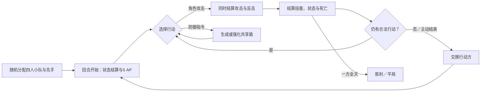

# Tiny Pixel Fights — Game Concept Document

### 游戏名称

**Tiny Pixel Fights**  
当前状态：**暂定名称／WIP**。名称继承自课程提供的原始卡牌游戏，最终发布前可根据主题与世界观重新命名。

### GDD日期

**2026年6月21日**  
文档状态：概念版本 V0.1  
预计发布日期：待定

### 概述

《Tiny Pixel Fights》是一款面向两名玩家的短局角色卡牌对战游戏。双方从八名中世纪幻想角色中随机获得四人小队，每回合使用有限的行动点，决定由谁攻击谁、以怎样的顺序行动，以及是否牺牲进攻机会展开全队防御。玩家的目标是让对方四名角色全部失去战斗能力。

攻击者会同时受到目标的反击，因此每次进攻都是一次交换，而不是单方面输出。角色拥有不同的攻击类型、生命、行动费用和专属技能，随机队伍会产生不同的协同与克制。游戏追求**短而有分量的选择、快速推进的战斗，以及可以理解和应对的意外**。新玩家一局目标约为 **10分钟**，熟练玩家约为 **5分钟**。

游戏以暗黑中世纪的皇家沙盘为舞台，使用黑铁、旧金、象牙白和红色强调构成简洁而锋利的界面。气氛应像两名指挥官在烛光下迅速推演一场残酷的小规模战斗，而不是展开一场漫长战争。

角色美术基调示例：

### 游戏机制

#### 1. 主动攻击与同时反击

玩家选择一名己方角色，再指定一名敌方角色作为目标。攻击者造成自身攻击力对应的物理或魔法伤害；防守者同时反击，基础反击伤害比其基础攻击低1、最低为1。即使防守者在本次交换中被击倒，已经成立的反击仍会结算。技能产生的额外伤害不会再触发反击。

这一规则让目标选择具有风险：攻击高威胁角色可以阻止其未来行动，但也可能承受更强反击；攻击脆弱角色更容易完成击杀，却可能放过其他关键技能。

#### 2. 行动点与角色费用

每名玩家的回合开始时获得 **5 AP**，不能保留到下回合。每名角色拥有1～3点Cost，命令其主动攻击时支付相应AP；同一角色每回合最多攻击一次。

玩家可以让四名1费角色连续行动、组合两名2费角色，或用`1+3`让轻型角色配合高费角色。战略来自有限资源下的行动顺序和机会成本，而不是大量菜单。

#### 3. 四人随机小队

八名角色会被随机分成两支四人队，并保证双方至少各有一名 1 Cost 角色。先手也随机决定；游戏第一回合不发动回合开始型技能，避免先手在行动前额外获得被动收益。

随机性负责制造队伍变化，但双方的角色、属性、技能和状态全部公开。玩家应能根据现有信息规划，而不是盲猜隐藏规则。

#### 4. 角色技能、Buff与Debuff

主动技能随角色攻击自动触发，被动技能在角色存活或满足条件时生效，不额外增加技能按钮。

| 角色 | 战术特征 |
|---|---|
| 公主 | 在己方回合开始时治疗全队，可略微突破生命上限 |
| 占卜师 | 为全队提供概率减伤，并赋予可被驱散的魔法攻击与炎上强化 |
| 农民 | 先播种，下一次己方回合获得短暂攻击强化 |
| 魔法使 | 高魔法攻击，并有概率施加延迟伤害“炎上” |
| 德鲁伊 | 发动时随机移除目标1个可驱散攻击强化Buff，并施加下回合进攻−2的“衰弱” |
| 狂战士 | 主动攻击造成至少3点伤害时，将1点物理余波传给相邻敌人 |
| 怪物 | 对非公主的0伤害攻击进行绝对追击；我方公主存活时强化追击，阵亡后强化怪物基础攻击 |
| 骑士 | 为全员显示共享一次的守护Buff；共享盾未完全吸收主动物理伤害时，为骑士以外的队友代受1点 |

状态会明确显示来源、效果和持续时间。技能之间存在协同与相性，但不应形成固定的万能组合。

#### 5. 公共防御指令

玩家可以消耗2 AP展开全队共享盾2，且不影响反击；同一回合若盾仍存在，再追加1 AP，可在当前盾值上+2，并使全员下一次反击伤害-1。若盾已被打空，再次使用防御指令会回到第一层。盾值由全队共用，可吸收物理、魔法、主动攻击、反击、普通技能或状态伤害，但不能吸收绝对伤害。

第一层防御阵型不附带反击惩罚；第二层会为全员赋予一次性Debuff“有恃无恐”，使各角色下一次反击伤害-1。每名角色完成一次反击后分别解除；未发动则在该玩家下个回合开始时消失。

#### 6. 胜负与对局循环

一方四名角色全部失去战斗能力时，对手获胜；若一次同时伤害让双方全部倒下，则为平局。

游戏同时支持：

- **本地对战**：两名玩家在同一台电脑轮流操作。
- **在线房间**：主办方创建房间，通过邀请链接让另一名玩家加入；双方共用相同的规则和内容。

### 用户界面

战场由上下两支四人队组成。在线模式中，己方固定显示在下方，对手显示在上方；本地模式会让当前行动方位于下方。重要 HUD 显示当前行动玩家、回合数、剩余 AP、共享盾值和结束回合按钮。

每张角色卡包括：

- 顶部：角色名称与 Cost。
- 左下：当前攻击力与物理／魔法类型。
- 右下：当前 HP／最大 HP。
- 立绘下方：最多两行技能摘要。
- 卡片状态：可行动时提亮，行动后或无法支付 Cost 时灰化。

鼠标悬停或触摸卡片时，卡片两侧展开详情：一侧显示属性与完整技能，另一侧显示当前 Buff／Debuff。玩家可拖拽卡片上方的红色攻击箭头到敌人，也可依次点击攻击者与目标。执行前显示预计伤害、反击、盾牌吸收和可能触发的技能。

所有战斗结果需要形成清楚的反馈链：发动者提亮 → 攻击／技能标识 → 命中目标 → 盾牌或 HP 变化 → 状态更新 → 死亡动画。物理、魔法、治疗、炎上、守护和共享盾使用不同但统一的图标与短动画。界面支持日语和简体中文，语言在标题画面选择；BGM与音效可在 HUD 中开关。

### 其他参考

#### Tiny Pixel Fights 原始课程卡牌

原型提供了八名角色、四人对战布局以及“攻击一名敌人并承受反击”的基础结构。本项目保留其容易上手、便于快速测试的核心，再加入 AP、Cost、技能、状态、共享盾与数字化反馈，使每次目标选择更有代价和辨识度。

#### Persona 系列的界面表现

参考其高对比度、强方向感、迅速切入的信息层级，以及红色强调带来的行动感。借鉴重点是“操作发生时界面也在表达动作”，而不是复制具体字体、图标、角色或版式。

#### 中世纪纹章与战争沙盘

黑铁盾牌、旧金纹章、羊皮纸、沙面、皇家印记和烛光共同构成视觉语汇。它们让抽象的卡牌数值看起来像一次战术推演，也为物理、魔法、防御和各职业技能提供一致的图形来源。

#### 经典回合制RPG的状态反馈

Buff、Debuff、伤害类型和行动顺序采用玩家容易识别的回合制语言，但保持公开、短促和低层级：玩家不需要进入多层菜单，主要注意力始终放在“谁攻击谁、现在花多少AP、之后会发生什么”。
