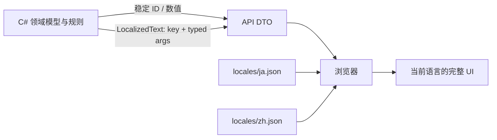

# Tiny Pixel Fights 本地化架构

## 目标

游戏规则层只处理稳定 ID 和数值，不保存任何面向玩家的日文或中文。日语与中文是同等地位的显示资源，不存在“先生成日文，再用正则猜成中文”的中间步骤。

## 数据流



服务器不会返回一段固定语言的战报，而会返回消息 key 与带类型的参数。浏览器根据当前语言分别翻译角色 ID、伤害类型和整句模板。因此切换语言不会改变规则数据，也不会发生中文句子夹入日文词汇。

## 文件职责

- `Domain/CharacterDefinition.cs`：角色 ID、属性、素材文件名、技能 ID。
- `Domain/Skills.cs`：技能逻辑和技能 ID，不含技能名称或说明。
- `Domain/StatusEffects.cs`：状态逻辑和状态 ID，不含显示文本。
- `Domain/GameTypes.cs`：`LocalizedText`、参数类型和消息构造辅助方法。
- `Api/GameDtos.cs`：只发送稳定 ID、枚举名、数值及结构化消息。
- `wwwroot/locales/ja.json`：全部日语显示资源。
- `wwwroot/locales/zh.json`：全部中文显示资源。
- `wwwroot/i18n.js`：按 key 查资源、替换结构化参数；不包含语言间正则翻译。

## 新增角色或技能

1. 在 C# 中使用 ASCII 稳定 ID，例如 `forest-ranger`、`piercing-shot`。
2. 在 `CharacterCatalog` 登记规则数值与素材名。
3. 实现技能类，`SkillMetadata` 只保存技能 ID 与主动／被动枚举。
4. 在 `ja.json` 和 `zh.json` 的 `characters`、`skills` 同时加入同名 ID。
5. 若新增状态，在两个资源文件的 `statuses` 加入同名 ID。
6. 若新增日志或错误，C# 返回 `L10n.Text("log.someEvent", ...)`，并在两个资源文件的 `messages` 加入同名模板。
7. 运行验证命令。

```powershell
dotnet build
node --test tests\*.test.js
node --check wwwroot\app.js
node --check wwwroot\i18n.js
```

测试会阻止 C# 混入中日文、日中资源结构不一致、重新引入正则翻译，以及前端引用不存在的 UI key。

## 玩家自定义名称

在线玩家输入的名字属于用户数据，服务器按原文保存并显示；默认名字使用 `player.1` / `player.2`，由前端翻译为当前语言。自定义名字不会被错误地当作翻译 key。
